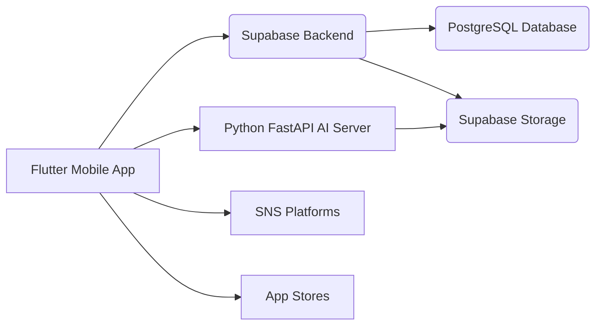

# Technical Requirements Document (TRD)

## 1. Executive Technical Summary
- **Project Overview**: Flutter 프레임워크와 Supabase 백엔드를 활용하여 사용자 일상 기반의 4컷 만화를 생성하는 모바일 다이어리 앱을 개발합니다. AI 기반 만화 생성 기능은 Python 기반 서버에서 처리하며, 생성된 만화 이미지는 Supabase Storage에 저장됩니다.
- **Core Technology Stack**: Flutter, Supabase, Supabase Auth, In-App Purchases, Python
- **Key Technical Objectives**:
    - 빠른 응답 속도 및 안정적인 서비스 제공
    - 확장 가능한 아키텍처 설계
    - 사용자 데이터 보안 및 개인 정보 보호
- **Critical Technical Assumptions**:
    - 안정적인 인터넷 연결 환경
    - AI 모델의 정확도 및 성능 확보
    - Supabase 서비스의 안정적인 운영

## 2. Tech Stack

| Category          | Technology / Library        | Reasoning (Why it's chosen for this project) |
| ----------------- | --------------------------- | -------------------------------------------- |
| Platform          | Flutter                     | iOS 및 Android 플랫폼 동시 개발 및 유지 보수 용이, 빠른 개발 속도, 풍부한 UI 라이브러리 제공 |
| Backend           | Supabase                    | 서버리스 아키텍처, 인증, 데이터베이스, 스토리지 기능 통합 제공, 빠른 개발 및 배포, 확장성 용이 |
| Authentication    | Supabase Auth               | 안전하고 간편한 사용자 인증 기능 제공 (소셜 로그인, 이메일/비밀번호 로그인 등) |
| Database          | Supabase PostgreSQL          | 안정적인 데이터 저장 및 관리, 확장성 용이, ACID 트랜잭션 지원 |
| Storage           | Supabase Storage            | 이미지 및 파일 저장 및 관리 용이, CDN 통합 제공 |
| In-App Purchases | Flutter in_app_purchase plugin | iOS 및 Android 인앱 결제 기능 통합 및 관리 용이 |
| AI Backend        | Python                      | 머신러닝 및 딥러닝 라이브러리 풍부, AI 모델 개발 및 배포 용이 |
| NLP Library        | spaCy, NLTK                 | 자연어 처리 기능 제공, 일기 내용 분석 및 키워드 추출 |
| Image Generation   | DALL-E 3 API, Stable Diffusion | 텍스트 기반 이미지 생성 기능 제공, 다양한 스타일의 만화 이미지 생성 |
| API Framework     | FastAPI                     | Python 기반 고성능 API 개발 프레임워크, 빠른 개발 및 배포 |

## 3. System Architecture Design

### Top-Level building blocks
- **Frontend (Flutter Mobile App)**:
    - 사용자 인터페이스 및 사용자 경험 제공
    - 일기 작성, 만화 생성 요청, SNS 공유 등의 기능 제공
    - Supabase Auth를 통한 사용자 인증 및 관리
    - In-App Purchases를 통한 결제 처리
- **Backend (Supabase)**:
    - 데이터베이스 (PostgreSQL)를 통한 일기 및 만화 데이터 저장 및 관리
    - Supabase Storage를 통한 이미지 파일 저장 및 관리
    - API Gateway를 통한 API 요청 처리 및 라우팅
- **AI Server (Python FastAPI)**:
    - 일기 내용을 기반으로 AI 모델을 통해 4컷 만화 이미지 생성
    - DALL-E 3 API 또는 Stable Diffusion 모델 활용
    - 생성된 이미지를 Supabase Storage에 저장
- **External Services**:
    - SNS 플랫폼 API (Facebook, Instagram, Twitter 등)를 통한 만화 이미지 공유 기능 제공
    - Apple App Store 및 Google Play Store를 통한 앱 배포 및 관리

### Top-Level Component Interaction Diagram



- Flutter Mobile App은 Supabase Backend를 통해 사용자 인증, 데이터 저장/조회, 결제 처리 등의 기능을 수행합니다.
- Flutter Mobile App은 Python FastAPI AI Server에 일기 내용을 전달하여 4컷 만화 이미지 생성을 요청하고, 생성된 이미지를 Supabase Storage에서 다운로드합니다.
- Flutter Mobile App은 SNS Platforms API를 통해 생성된 만화 이미지를 공유합니다.
- Flutter Mobile App은 App Stores를 통해 배포 및 업데이트됩니다.

### Code Organization & Convention
**Domain-Driven Organization Strategy**
- **Domain Separation**: 사용자 관리, 일기 관리, 만화 생성, 결제 처리 등으로 도메인 분리
- **Layer-Based Architecture**: Presentation (UI), Business Logic, Data Access, Infrastructure 레이어로 분리
- **Feature-Based Modules**: 각 기능별 모듈화 (예: 일기 작성 모듈, 만화 생성 모듈, SNS 공유 모듈)
- **Shared Components**: 공통 유틸리티, 타입, 재사용 가능한 컴포넌트를 별도 모듈로 관리

**Universal File & Folder Structure**
```
/
├── lib/
│   ├── core/                      # 공통 유틸리티, 상수, 타입 정의
│   │   ├── utils/
│   │   ├── constants/
│   │   └── models/
│   ├── features/                 # 기능별 모듈
│   │   ├── diary/                 # 일기 관련 기능
│   │   │   ├── presentation/     # UI 컴포넌트
│   │   │   ├── domain/           # 비즈니스 로직
│   │   │   ├── data/             # 데이터 접근 및 관리
│   │   │   └── models/           # 일기 관련 데이터 모델
│   │   ├── comic/                 # 만화 생성 관련 기능
│   │   │   ├── presentation/
│   │   │   ├── domain/
│   │   │   ├── data/
│   │   │   └── models/
│   │   ├── auth/                  # 사용자 인증 관련 기능
│   │   │   ├── presentation/
│   │   │   ├── domain/
│   │   │   ├── data/
│   │   │   └── models/
│   │   └── ...
│   ├── widgets/                   # 재사용 가능한 위젯
│   ├── services/                  # 외부 서비스 연동
│   │   ├── supabase_service.dart
│   │   ├── ai_server_service.dart
│   │   └── ...
│   └── app.dart                   # 앱 시작점
├── pubspec.yaml
├── README.md
└── ...
```

### Data Flow & Communication Patterns
- **Client-Server Communication**: Flutter 앱은 Supabase Backend API를 통해 데이터를 요청하고 응답을 받습니다. (RESTful API)
- **Database Interaction**: Supabase PostgreSQL 데이터베이스는 Supabase ORM을 통해 데이터를 CRUD (Create, Read, Update, Delete) 합니다.
- **External Service Integration**: SNS 플랫폼 API는 Flutter 앱에서 직접 호출하거나 Supabase Backend를 통해 호출될 수 있습니다. AI Server API는 Flutter 앱 또는 Supabase Backend에서 호출될 수 있습니다.
- **Real-time Communication**: 실시간 알림 기능은 Supabase Realtime 또는 Firebase Cloud Messaging (FCM)을 통해 구현될 수 있습니다.
- **Data Synchronization**: 데이터 일관성을 위해 트랜잭션 및 optimistic locking 패턴을 적용합니다.

## 4. Performance & Optimization Strategy
- 이미지 최적화: 이미지 크기 및 해상도 최적화, CDN 활용
- 캐싱 전략: API 응답 캐싱, 이미지 캐싱, 데이터베이스 쿼리 캐싱
- 비동기 처리: 백그라운드 작업 활용, UI 스레드 블로킹 방지
- 데이터베이스 쿼리 최적화: 인덱싱, 쿼리 튜닝, 배치 처리
- AI 모델 최적화: 모델 경량화, 추론 속도 향상, GPU 활용

## 5. Implementation Roadmap & Milestones
### Phase 1: Foundation (MVP Implementation)
- **Core Infrastructure**: Flutter 개발 환경 구축, Supabase 프로젝트 설정, AI Server 환경 구축
- **Essential Features**: 일기 작성 및 저장 기능, AI 기반 4컷 만화 생성 기능, 만화 이미지 다운로드 기능, 사용자 인증 기능
- **Basic Security**: 사용자 데이터 암호화, API 보안 설정
- **Development Setup**: 개발 환경 설정, CI/CD 파이프라인 구축 (GitHub Actions, GitLab CI 등)
- **Timeline**: 8주

### Phase 2: Feature Enhancement
- **Advanced Features**: SNS 공유 기능, 일기 및 만화 보관 기능, 일기 알림 기능, 인앱 결제 기능
- **Performance Optimization**: 이미지 최적화, 캐싱 전략 적용, 데이터베이스 쿼리 최적화
- **Enhanced Security**: 보안 취약점 점검 및 수정, 개인 정보 보호 강화
- **Monitoring Implementation**: 성능 모니터링, 오류 로깅, 사용량 분석 (Sentry, Firebase Analytics 등)
- **Timeline**: 12주

## 6. Risk Assessment & Mitigation Strategies
### Technical Risk Analysis
- **Technology Risks**: AI 모델의 정확도 및 성능 부족, Supabase 서비스 장애, 외부 API 의존성
- **Performance Risks**: 느린 응답 속도, 높은 트래픽으로 인한 서버 과부하
- **Security Risks**: 사용자 데이터 유출, API 공격, 인앱 결제 보안 취약점
- **Integration Risks**: SNS 플랫폼 API 변경, AI Server API 호환성 문제
- **Mitigation Strategies**:
    - AI 모델 성능 개선을 위한 지속적인 학습 및 튜닝
    - Supabase 서비스 장애 대비 백업 및 복구 시스템 구축
    - 외부 API 변경에 대한 모니터링 및 대응 계획 수립
    - 성능 테스트 및 부하 테스트를 통한 성능 병목 지점 파악 및 개선
    - 보안 취약점 점검 및 코드 리뷰를 통한 보안 강화
    - API 버전 관리 및 호환성 테스트를 통한 API 호환성 유지

### Project Delivery Risks
- **Timeline Risks**: 개발 일정 지연, 기능 구현 난이도 증가
- **Resource Risks**: 개발 인력 부족, 기술 전문가 부족
- **Quality Risks**: 코드 품질 저하, 테스트 부족
- **Deployment Risks**: 배포 과정에서의 오류 발생, 환경 설정 문제
- **Contingency Plans**:
    - 개발 일정 지연에 대한 대비책 마련 (예: 기능 축소, 추가 인력 투입)
    - 개발 인력 부족에 대한 대비책 마련 (예: 외부 전문가 활용, 교육 프로그램 운영)
    - 코드 품질 저하 방지를 위한 코드 리뷰 및 테스트 강화
    - 배포 과정에서의 오류 발생 대비 자동화된 배포 시스템 구축 및 테스트 환경 구축
